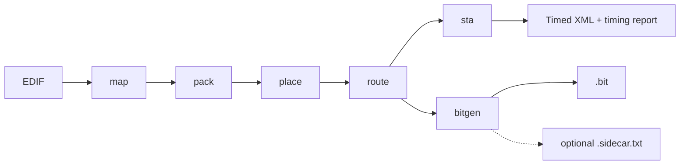

<div align="center">

# fde-rs

**A deterministic Rust implementation flow for FDE — from EDIF to bitstream.**

<p>
  Rust-first architecture, explicit stage boundaries, readable artifacts, and board-facing regressions.
</p>

<p>
  <a href="https://github.com/0xtaruhi/fde-rs/actions/workflows/ci.yml">
    
  </a>
  <a href="LICENSE">
    
  </a>
  
  
</p>

<p>
  
  
  
</p>

<p>
  <a href="https://github.com/0xtaruhi/fde-rs/stargazers">
    
  </a>
  <a href="https://github.com/0xtaruhi/fde-rs/network/members">
    
  </a>
</p>

<p>
  <a href="#quick-start"><strong>Quick start</strong></a>
  ·
  <a href="#pipeline"><strong>Pipeline</strong></a>
  ·
  <a href="#board-regressions"><strong>Board regressions</strong></a>
  ·
  <a href="#development"><strong>Development</strong></a>
</p>

</div>

---

## Why fde-rs

`fde-rs` is the standalone Rust home for the FDE implementation flow.

It is built around a few non-negotiables:

- **Determinism first** — fixed seeds should reproduce the same implementation output.
- **Clear stage boundaries** — `map`, `pack`, `place`, `route`, `sta`, and `bitgen` stay separate.
- **Typed IR over string soup** — shared Rust data structures are the source of truth.
- **Thin CLI, strong library core** — orchestration lives at the edge, logic stays reusable.
- **Debuggable artifacts** — each stage emits readable outputs that make failures inspectable.
- **Hardware-facing compatibility** — XML and bitstream artifacts remain a stable contract.

If you already synthesize with Yosys and want a modern, maintainable, board-oriented
implementation flow in Rust, this repository is the intended path.

## Highlights

| Capability | Status |
| --- | --- |
| EDIF import and normalization | ✅ |
| Packing and placement | ✅ |
| Physical routing with emitted pips | ✅ |
| STA summary and timing report | ✅ |
| Deterministic bitgen | ✅ |
| Optional debug sidecar emission | ✅ |
| Checked-in board regression corpus | ✅ |
| Full Rust `impl` orchestration | ✅ |

## Pipeline



The main entrypoint is `fde impl`, which drives the full staged pipeline and writes
all intermediate artifacts to disk.

## Quick start

### Build

```bash
cargo build
```

### Run the full flow

```bash
cargo run --bin fde -- impl \
  --input examples/blinky/blinky.edf \
  --constraints examples/blinky/constraints.xml \
  --resource-root resources/hw_lib \
  --out-dir build/blinky-run
```

Add `--emit-sidecar` when you want the extra human-readable debug dump.

### Typical outputs

A normal implementation run emits:

```text
01-mapped.xml
02-packed.xml
03-placed.xml
04-routed.xml
04-device.json
05-timed.xml
05-timing.rpt
06-output.bit
report.json
summary.rpt
run.log
```

For debug-oriented inspection, add `--emit-sidecar` to also write:

```text
06-output.sidecar.txt
```

## Command-line usage

Show top-level help:

```bash
cargo run --bin fde -- --help
```

Run individual stages:

```bash
cargo run --bin fde -- map --input design.edf --output build/01-mapped.xml
cargo run --bin fde -- pack --input build/01-mapped.xml --output build/02-packed.xml --family fdp3
cargo run --bin fde -- place --input build/02-packed.xml --output build/03-placed.xml \
  --arch resources/hw_lib/fdp3p7_arch.xml \
  --delay resources/hw_lib/fdp3p7_dly.xml \
  --constraints constraints.xml
cargo run --bin fde -- route --input build/03-placed.xml --output build/04-routed.xml \
  --arch resources/hw_lib/fdp3p7_arch.xml \
  --cil resources/hw_lib/fdp3p7_cil.xml \
  --constraints constraints.xml
cargo run --bin fde -- sta --input build/04-routed.xml --output build/05-timed.xml \
  --report build/05-timing.rpt \
  --arch resources/hw_lib/fdp3p7_arch.xml \
  --delay resources/hw_lib/fdp3p7_dly.xml
cargo run --bin fde -- bitgen --input build/04-routed.xml --output build/06-output.bit \
  --arch resources/hw_lib/fdp3p7_arch.xml \
  --cil resources/hw_lib/fdp3p7_cil.xml
```

Emit the optional debug sidecar:

```bash
cargo run --bin fde -- bitgen --input build/04-routed.xml --output build/06-output.bit \
  --arch resources/hw_lib/fdp3p7_arch.xml \
  --cil resources/hw_lib/fdp3p7_cil.xml \
  --emit-sidecar
```

## Releases

Tag-driven releases are automated through GitHub Actions.

### Recommended release flow

1. Update `Cargo.toml` to the version you want to ship.
2. Run the normal quality bar locally:

```bash
cargo fmt --all -- --check && \
cargo check --locked --all-targets && \
cargo clippy --locked --all-targets --all-features -- -D warnings && \
cargo test --locked --quiet
```

3. Create and push the release tag:

```bash
git tag v1.0.0
git push origin v1.0.0
```

That tag triggers `.github/workflows/release.yml`, which:

- verifies the tag matches `Cargo.toml`
- reruns the quality bar plus a release smoke test
- runs `cargo publish --dry-run`
- builds release binaries for Linux, macOS, and Windows
- packages each binary together with `resources/hw_lib`, `README.md`, `LICENSE`, and `BUILD_INFO.txt`
- generates `SHA256SUMS`
- publishes a GitHub Release automatically

### crates.io publishing

The same release workflow can also publish to crates.io, but it is intentionally
**gated** rather than always-on.

To enable it safely:

1. add the repository secret `CARGO_REGISTRY_TOKEN`
2. add the repository variable `ENABLE_CRATES_RELEASE=true`
3. create the GitHub environment `crates-io`
4. enable required reviewers on that environment

With that configuration in place, a release tag will publish GitHub assets
automatically and then pause for manual approval before running `cargo publish`.

If you want the GitHub Release only, do nothing: the crates.io job stays off by default.

## Frontend model: synthesize with Yosys first

`fde-rs` is intentionally **not** a full Verilog frontend.

The expected frontend flow is:

1. read Verilog in Yosys
2. synthesize to EDIF
3. hand the EDIF to `fde-rs`

Bundled helper:

```bash
python3 scripts/synth_yosys_fde.py \
  --top your_top \
  --out-edf build/your_top.edf \
  path/to/your_top.v
```

The helper lowers Yosys arithmetic accumulators with `maccmap -unmap` plus a
follow-up `techmap`/`simplemap` sweep, so downstream stages do not see raw
`$macc_v2` or `$mul` cells in the exported EDIF.

If you already have your own Yosys flow, any compatible EDIF is fine, but make
sure arithmetic cells are similarly lowered before exporting EDIF.

## Board regressions

Board-facing cases live under [`examples/board-e2e/`](examples/board-e2e).
Each case includes:

- a checked-in `.edf`
- a checked-in `constraints.xml`
- expected probe outputs recorded in [`manifest.json`](examples/board-e2e/manifest.json)

Run the live board suite:

```bash
python3 scripts/board_e2e.py run
```

Run a single case:

```bash
python3 scripts/board_e2e.py run logic-mesh
```

Some cases override the default waveform via `probe_segments` in the manifest so
long-cycle hardware behavior stays reproducible.

## Development

### Fast local checks

```bash
cargo fmt --all -- --check
cargo check --locked --all-targets
cargo clippy --locked --all-targets --all-features -- -D warnings
cargo test --locked
```

### CI parity

```bash
cargo fmt --all -- --check && \
cargo check --locked --all-targets && \
cargo clippy --locked --all-targets --all-features -- -D warnings && \
cargo test --locked --quiet
```

### Useful scripts

- `python3 scripts/board_e2e.py run`
- `python3 scripts/random_board_diff.py --count 5 --seed 20260322 --keep-going`
- `python3 scripts/slice_config_diff.py --packed <02-packed.xml> --sidecar <06-output.sidecar.txt>`

## Repository layout

```text
src/
  app/        CLI and orchestration
  core/       typed IR and semantic domain helpers
  infra/      EDIF, XML, resources, constraints, serialization
  stages/     map, pack, place, route, sta, bitgen
examples/     sample inputs and board regressions
docs/         design notes and refactor plans
scripts/      synthesis, board, and debug helpers
```

## Design principles

- **Determinism matters**
- **Typed IR first**
- **Thin CLI layer**
- **Clear stage ownership**
- **Readable artifacts for debugging**
- **Compatibility at the file boundary**

## Running on Linux
To allow userspace access to the usb device, kindly run the following command:
```bash
sudo cp 99-FDE.rules /etc/udev/rules.d/99-FDE.rules
sudo udevadm control --reload-rules
sudo udevadm trigger 
```
At this point, the USB device should be discoverable when running the programmer. Otherwise, you can debug udev events to check whether the permissions are set correctly:
```bash
udevadm monitor --property --udev
```

Lastly, if everything fails, you can confirm that the program can be uploaded by running as root user in the folder: (change debug to release if you compiled it in release mode)
```bash
sudo tools/wave_probe/target/debug/wave_probe /build/blinky-run/06-output.bit
```

## Repository Scope

The public contract is the emitted XML and bitstream shape. Internally, Rust stays
free to use stronger typed models as long as those external artifacts remain stable,
inspectable, and useful.

## Project status

`fde-rs` is under active development, but it already supports meaningful end-to-end
implementation, board-facing regressions, and deterministic bitstream generation in
Rust.

## License

This project is licensed under the terms of the [MIT License](LICENSE).
